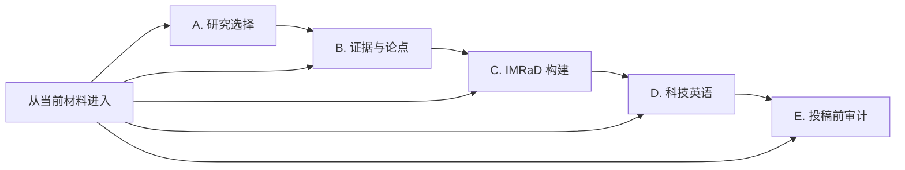

# Research to Paper Workflow

> 一个证据驱动的 Codex Skill：从研究方向选择，到论点—证据组织、IMRaD 成稿、科技英语修改和投稿前审计。

`research-to-paper-workflow` 解决的不是“怎样一次生成一篇看起来像论文的文字”，而是另一个更关键的问题：**当前研究究竟处于哪一步，现有证据允许我们完成什么，下一份可检查的成果是什么？**

它允许从任意阶段进入，但不允许用流畅语言掩盖证据缺口。

## 为什么做这个 Skill

科研中的选错方向、证据越界、章节功能混乱和英文表达含糊，看似是四类问题，实际上经常发生在同一条链条上：

1. 不清楚为什么选择这个研究问题；
2. 把观察结果、推断和机制假设混在一起；
3. 在证据链不稳定时过早写完整论文；
4. 用润色强化了原本没有证据支持的确定性；
5. 投稿前只查语法，没有先查科学论证。

这个 Skill 将这些问题连接成一条可中途进入、可逐步验收的工作流。

## 三类方法如何汇合

本 Skill 受到三本书所代表的方法域启发：

- 《科研论·1：选择的重量》：研究选择、信息搜集、比较和规划；
- Hilary Glasman-Deal 的 *Science Research Writing*（第二版）：科学论文各章节的功能化构建；
- Strunk 与 White 的 *The Elements of Style*：清楚、简洁、以读者为中心的英文表达。

这是一项**独立的工作流综合**，不是三本书的官方改编、替代品或内容复刻。仓库不包含章节全文、专有练习或长篇引文。哪些内容来自公开可确认的书目范围，哪些属于工作流综合和通用科研写作实践，详见 [source-map.md](references/source-map.md)。

## 五阶段工作流



| 阶段 | 典型输入 | 核心成果 |
|---|---|---|
| A. Research Choice | 候选方向、导师、资源、时间和目标 | 选择记录、比较矩阵、风险与停止条件 |
| B. Evidence and Claim | 文献、观察、数据、图表和初步解释 | 事实—推断—假设台账、论点—证据—缺口矩阵 |
| C. IMRaD Construction | 已稳定的研究问题和证据链 | 章节功能骨架、段落计划或边界清楚的草稿 |
| D. Scientific English | 含义已经明确的中英文文本 | 保持科学含义的英文修改与变更说明 |
| E. Pre-Submission Audit | 部分或完整稿件及配套材料 | 有边界的准备度结论、P0–P3 问题清单 |

修订顺序固定为：

```text
证据 → 论证 → 结构 → 语言
```

## 核心护栏

- 区分 **Verified fact / Inference / Hypothesis / Unknown**。
- 不虚构数据、样本量、显著性、方法、引用、实验条件或机制。
- 英文润色不得强化确定性、因果、机制、创新性或适用范围。
- 已有下游材料时直接进入当前阶段，不强迫重新选题。
- 信息不足时先产生可用的局部成果，每次最多问一个真正阻塞的问题。
- 每轮用“决策卡”保留已确认事实、未解决问题和下一阶段准入条件。

## 安装

### Windows PowerShell

```powershell
git clone https://github.com/Hu-yucheng/research-to-paper-workflow.git

$source = Resolve-Path '.\research-to-paper-workflow'
$target = Join-Path $env:USERPROFILE '.codex\skills\research-to-paper-workflow'
New-Item -ItemType Directory -Force -Path $target | Out-Null
Copy-Item "$source\SKILL.md" $target -Force
Copy-Item "$source\agents" $target -Recurse -Force
Copy-Item "$source\references" $target -Recurse -Force
Copy-Item "$source\assets" $target -Recurse -Force
```

最终应存在：

```text
~/.codex/skills/research-to-paper-workflow/SKILL.md
```

也可以下载 ZIP，解压后仅将 `SKILL.md`、`agents/`、`references/` 和 `assets/` 复制到上述目录。

## 使用示例

显式调用：

```text
Use $research-to-paper-workflow to compare these three research directions and tell me what evidence I need before choosing one.
```

```text
使用 $research-to-paper-workflow，把我这组三种纤维素膜的数据整理成事实—推断—假设台账，再判断能否开始写 Results 和 Discussion。
```

```text
使用 $research-to-paper-workflow 审计下面这段英文。先指出证据越界，再做不改变科学含义的润色。
```

Skill 也支持从自然请求中被隐式触发，例如选题比较、IMRaD 规划、科技英语修改或投稿前审稿。

## 输出成果

主线成果可写入 [Research Dossier 模板](assets/research-dossier-template.md)，包括：

- Research Choice Record；
- Research Question and Scope；
- Fact-Inference-Hypothesis Ledger；
- Claim-Evidence-Gap Matrix；
- Manuscript Architecture；
- Terminology and Style Decisions；
- Open Risks and Questions；
- Decision Log。

每次实质性工作以八字段决策卡结束：

```markdown
## 本轮决策卡

- 当前阶段：
- 已确认事实：
- 待验证推断或假设：
- 本轮关键决定：
- 形成的成果：
- 未解决问题：
- 下一阶段准入条件：
- 建议下一步：
```

## 仓库结构

```text
research-to-paper-workflow/
├── SKILL.md
├── agents/
│   └── openai.yaml
├── references/
│   ├── research-choice.md
│   ├── evidence-and-claims.md
│   ├── imrad-functions.md
│   ├── scientific-english.md
│   ├── audit-rubric.md
│   └── source-map.md
├── assets/
│   └── research-dossier-template.md
└── tests/
    ├── scenarios.md
    ├── acceptance-checklist.md
    └── validate.ps1
```

## 验证状态

当前版本包含五个预先固定的行为场景和依赖无关的结构检查：

```powershell
.\tests\validate.ps1
```

已检查 Skill 元数据、五阶段路由、八字段决策卡、UTF-8、局部链接、Markdown 围栏、P0–P3 审计等级和文件结构。

验证边界：本开发环境无法执行本地 `codex.exe`，因此 fresh-context 行为前后对照尚未运行；官方 `quick_validate.py` 也因当前 Python 缺少 `PyYAML` 未完成。仓库不会把结构验证冒充为行为验证，详情见 [validation-results.md](tests/validation-results.md) 和 [forward-results.md](tests/forward-results.md)。

## 局限

- 不能替代领域专家、统计审查、伦理审查或目标期刊要求。
- 没有提供或核验的文献、图表、补充方法和数据，不会被视为已检查。
- 不承诺论文录用，也不从文字流畅度推断研究质量。
- 当前公开资料只能确认三本书的书目范围；若要进一步精炼，可基于用户合法提供的目录、笔记或摘录更新 `source-map.md`。

## License 与致谢

代码与原创工作流文档采用 [MIT License](LICENSE)。书名和相关方法域归原作者及出版方所有；本仓库不授予对第三方书籍内容的任何权利。
